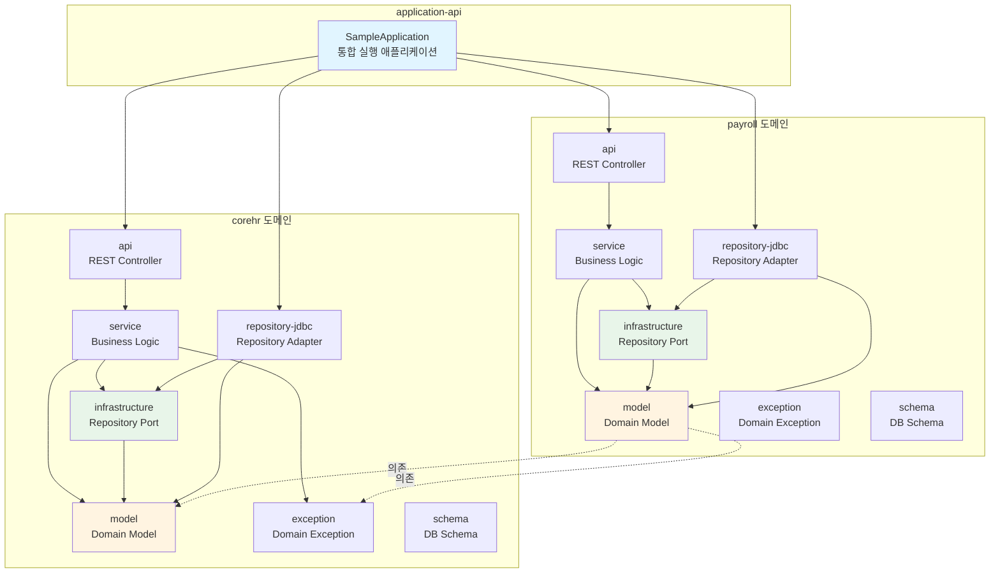
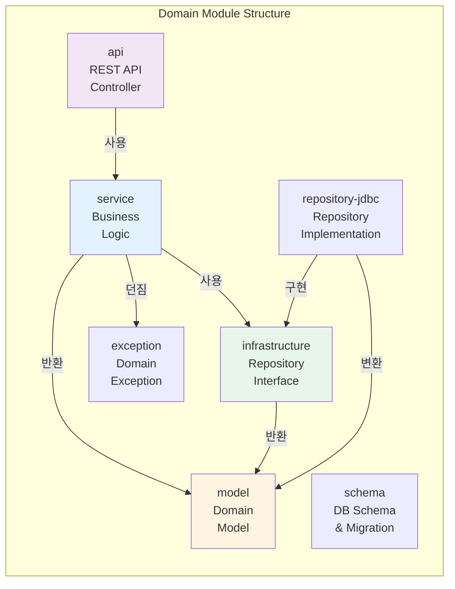
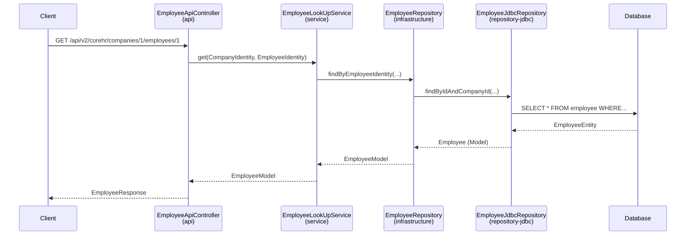
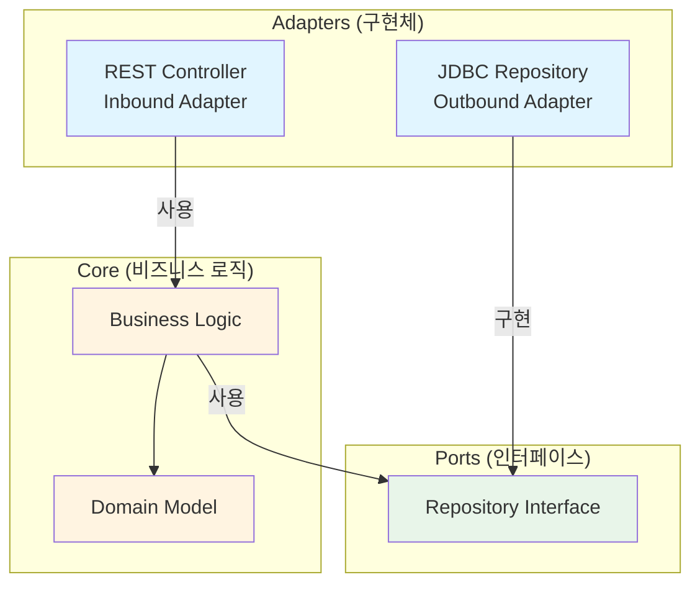
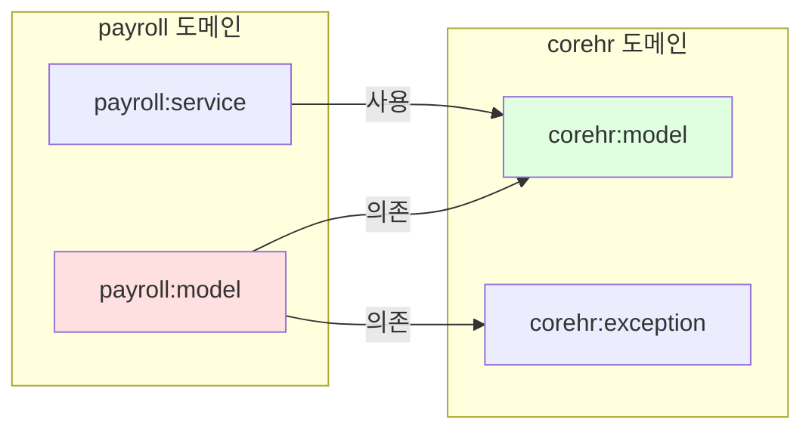
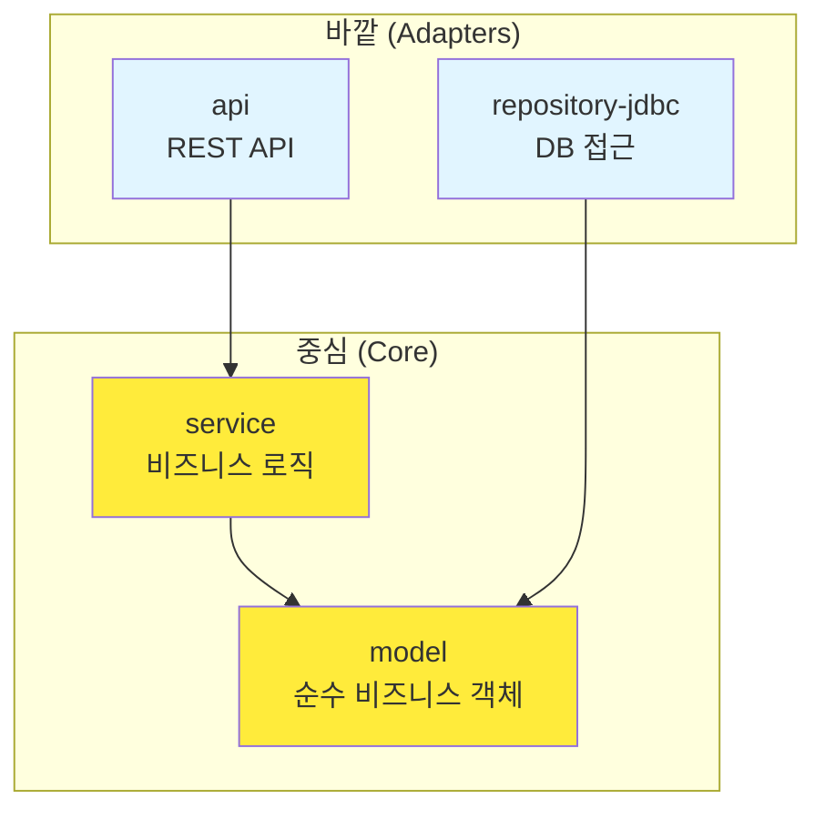
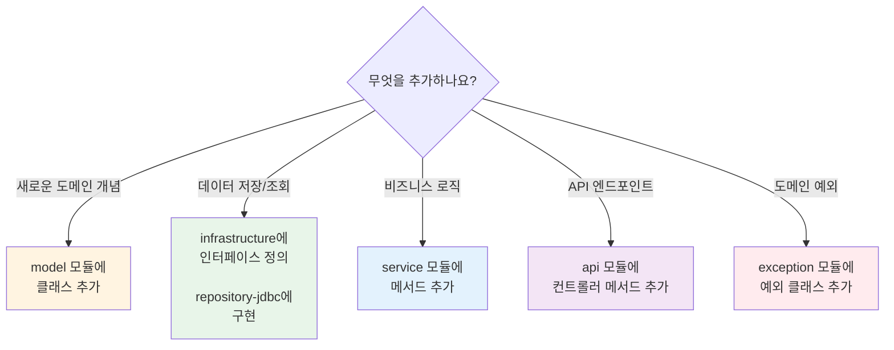

# Flex Module Sample 아키텍처 가이드

> 이 문서는 새로운 팀원을 위한 프로젝트 아키텍처 온보딩 가이드입니다.

## 목차

- [개요](#개요)
- [아키텍처 구조](#아키텍처-구조)
- [핵심 설계 원칙](#핵심-설계-원칙)
- [장점](#장점)
- [단점](#단점)
- [신규 입사자 가이드](#신규-입사자-가이드)
- [실무 작업 가이드](#실무-작업-가이드)

---

## 개요

이 프로젝트는 **헥사고날 아키텍처(Hexagonal Architecture)**와 **도메인별 모듈 분리** 전략을 결합한 구조로 설계되었습니다.

기존의 ComponentScan 기반 단일 모듈 방식에서 벗어나, 각 도메인을 독립적인 모듈로 분리하여 **명시적 의존성 관리**와 **독립적인 개발/배포**를 가능하게 합니다.

### 프로젝트 구성

```
flex-module-sample/
├── corehr/          # 인사 관리 도메인
├── payroll/         # 급여 관리 도메인
└── application-api/ # 통합 애플리케이션
```

---

## 아키텍처 구조

### 전체 시스템 구조



### 도메인별 모듈 구조

각 도메인(corehr, payroll)은 동일한 7개의 모듈로 구성됩니다:



### 모듈별 책임

| 모듈 | 타입 | 책임 | 예시 |
|------|------|------|------|
| **model** | `kotlin-lib` | 순수 비즈니스 도메인 객체 정의 | `Employee`, `Payroll` |
| **exception** | `kotlin-lib` | 도메인 예외 정의 | `EmployeeNotFoundException` |
| **infrastructure** | `kotlin` | Repository 인터페이스 정의 (Port) | `EmployeeRepository` |
| **repository-jdbc** | `kotlin-boot-jdbc-repository` | Repository 구현 (Adapter) | `EmployeeJdbcRepository` |
| **service** | `kotlin-boot` | 비즈니스 로직 처리 | `EmployeeLookUpService` |
| **api** | `kotlin-boot-mvc` | REST API 엔드포인트 | `EmployeeApiController` |
| **schema** | `kotlin` | DB 스키마 및 마이그레이션 | Liquibase changelog |
| **application-api** | `kotlin-boot-mvc-application` | 독립 실행 가능한 Spring Boot 애플리케이션 | `CoreHrApplication` |

### 의존성 흐름 예시



---

## 핵심 설계 원칙

### 1. ComponentScan 제거 → AutoConfiguration 사용

**기존 방식의 문제점**:
```kotlin
@SpringBootApplication
@ComponentScan("team.flex.module.sample") // 어떤 빈이 등록될지 불명확
class Application
```

**현재 방식**:
```kotlin
@AutoConfiguration
class EmployeeRepositoryAutoConfiguration {
    @Bean
    fun employeeRepository(employeeJdbcRepository: EmployeeJdbcRepository): EmployeeRepository {
        return EmployeeRepositoryImpl(employeeJdbcRepository)
    }
}
```

모든 빈이 명시적으로 등록되어 **의존성이 투명**합니다.

### 2. 헥사고날 아키텍처 (Ports & Adapters)



**핵심 개념**:
- **Core**: 비즈니스 로직은 프레임워크와 독립적 (`model`, `service`)
- **Ports**: 외부와의 인터페이스 정의 (`infrastructure`)
- **Adapters**: 실제 기술 구현 (`api`, `repository-jdbc`)

### 3. 도메인 간 의존성 관리



**주의사항**: payroll이 corehr의 `CompanyIdentity`, `EmployeeIdentity`, `EmployeeNotFoundException`를 사용합니다. 순환 참조가 발생하지 않도록 주의해야 합니다.

---

## 장점

### 1. 명확한 책임 분리
- 각 모듈이 **단일 책임 원칙(SRP)** 준수
- `model`은 순수 비즈니스 로직만, `api`는 HTTP 처리만

### 2. 독립적인 테스트 가능
- 각 레이어를 독립적으로 테스트
- Mock 객체 생성이 쉬움 (인터페이스 기반)
- 예: `EmployeeLookUpService` 테스트 시 `EmployeeRepository`만 Mock

### 3. 기술 스택 교체 용이
- JDBC → JPA로 교체 시 `repository-jdbc` 모듈만 `repository-jpa`로 교체
- REST → GraphQL로 교체 시 `api` 모듈만 `graphql-api`로 교체
- 핵심 비즈니스 로직(`model`, `service`)은 영향 없음

### 4. 도메인별 독립 실행
- `CoreHrApplication`, `PayrollApplication` 각각 독립 실행 가능
- 마이크로서비스로 전환 시 유리

### 5. 팀별 개발 용이
- corehr 팀, payroll 팀이 독립적으로 개발 가능
- 모듈 경계가 명확하여 충돌 최소화

### 6. 명시적 의존성 관리
- ComponentScan의 "숨겨진 의존성" 문제 해결
- AutoConfiguration으로 어떤 빈이 등록되는지 명확
- IDE에서 의존성 추적 용이

### 7. 빌드 최적화
- 변경된 모듈만 재빌드 (Gradle 증분 빌드)
- CI/CD 파이프라인 시간 단축

### 8. 프레임워크 독립성
- `model` 모듈은 Spring에 의존하지 않음
- 비즈니스 로직의 생명주기가 프레임워크와 독립적
- 장기적으로 기술 부채 감소

---

## 단점

### 1. 초기 설정 복잡도
- 각 도메인당 8개 모듈 관리 (corehr 8개 + payroll 8개 = 16개)
- `gradle.properties`, `build.gradle.kts` 설정 파일 증가

### 2. 보일러플레이트 코드 증가
- AutoConfiguration 클래스 반복 작성
- Entity ↔ Model 변환 코드 필수
  ```kotlin
  private fun EmployeeEntity.toModel() = Employee(
      employeeId = employeeId,
      companyId = companyId,
      employeeNumber = employeeNumber,
      name = name,
      createdAt = createdAt,
      updatedAt = updatedAt,
  )
  ```

### 3. 학습 곡선
- 새로운 개발자가 전체 구조를 이해하는데 시간 소요
- "어디에 코드를 작성해야 하는가?" 혼란 가능
- 헥사고날 아키텍처 개념 이해 필요

### 4. 도메인 간 의존성 관리 어려움
- payroll → corehr 의존성 존재
- 순환 참조 발생 가능성 주의
- 도메인 경계 설계가 중요

### 5. 작은 프로젝트엔 오버엔지니어링
- 단순 CRUD만 하는 프로젝트엔 과도함
- 모듈 간 이동이 많아 초기 생산성 저하 가능

### 6. IDE 성능 저하
- 모듈이 많으면 IntelliJ 인덱싱 시간 증가
- 프로젝트 빌드 시간 증가 (첫 빌드)

---

## 신규 입사자 가이드

### "왜 이렇게 복잡해 보이나요?"

#### 기존 방식 (ComponentScan 기반 단일 모듈)
```kotlin
@ComponentScan("com.example")
class Application

// 문제점:
// 1. 어떤 빈이 등록되는지 모름 (런타임에 결정)
// 2. 패키지만 바꿔도 앱이 깨짐
// 3. 도메인 간 결합도 높음
// 4. 테스트 시 전체 컨텍스트 로딩 (느림)
// 5. 순환 참조 발견이 어려움
```

#### 현재 방식 (AutoConfiguration + 모듈 분리)
```kotlin
@AutoConfiguration
class EmployeeAutoConfiguration {
    @Bean  // 명시적으로 어떤 빈이 등록되는지 알 수 있음!
    fun employeeLookUpService(
        employeeRepository: EmployeeRepository
    ): EmployeeLookUpService = EmployeeLookUpServiceImpl(employeeRepository)
}

// 장점:
// 1. 어떤 빈이 등록되는지 명확
// 2. 모듈별 독립 테스트 가능
// 3. 기술 스택 교체 용이
// 4. 팀별 독립 개발 가능
// 5. 순환 참조가 컴파일 타임에 발견됨
```

### 핵심 개념 3가지만 기억하세요

#### 1. 헥사고날 아키텍처 = "비즈니스 로직을 중심에, 기술은 바깥에"



**비유**: 중심(Core)은 "비즈니스 규칙", 바깥(Adapter)는 "배달 방법"
- 비즈니스 규칙은 변하지 않음
- 배달 방법(REST, gRPC, Kafka 등)은 바뀔 수 있음

#### 2. 모듈 = 교체 가능한 부품

```
JDBC가 싫으면?
  repository-jdbc 모듈 제거
  → repository-jpa 모듈 추가
  → 비즈니스 로직(service, model)은 변경 없음!

REST가 싫으면?
  api 모듈 제거
  → graphql-api 모듈 추가
  → 비즈니스 로직(service, model)은 변경 없음!
```

#### 3. AutoConfiguration = 명시적 조립도

```kotlin
// "나는 이 부품들을 이렇게 조립할 거야" 라고 선언
@AutoConfiguration
class EmployeeAutoConfiguration {
    @Bean
    fun employeeLookUpService(repo: EmployeeRepository) =
        EmployeeLookUpServiceImpl(repo)
}
```

---

## 실무 작업 가이드

### 어디에 코드를 작성하나요?

**간단한 규칙**:



### 실무 시나리오별 가이드

#### 시나리오 1: 새로운 API 엔드포인트 추가

**요구사항**: "부서 목록 조회 API를 만들어주세요"

```
1. corehr/api 모듈
   └── DepartmentApiController.kt 에 메서드 추가
       ↓
2. corehr/service 모듈
   └── DepartmentLookUpService.kt 에 비즈니스 로직 추가
       ↓
3. corehr/infrastructure 모듈
   └── DepartmentRepository.kt 인터페이스에 메서드 정의
       ↓
4. corehr/repository-jdbc 모듈
   └── DepartmentJdbcRepository.kt 에 구현
```

#### 시나리오 2: 새로운 도메인 개념 추가

**요구사항**: "직급(JobLevel) 개념을 추가해주세요"

```
1. corehr/model 모듈
   └── company/joblevel/JobLevel.kt 생성
   └── company/joblevel/JobLevelModel.kt 생성
   └── company/joblevel/JobLevelIdentity.kt 생성

2. corehr/exception 모듈
   └── JobLevelNotFoundException.kt 생성

3. corehr/infrastructure 모듈
   └── company/joblevel/repository/JobLevelRepository.kt 생성

4. corehr/repository-jdbc 모듈
   └── company/joblevel/repository/JobLevelEntity.kt 생성
   └── company/joblevel/repository/JobLevelJdbcRepository.kt 생성
   └── company/joblevel/repository/JobLevelRepositoryAutoConfiguration.kt 생성

5. corehr/service 모듈
   └── company/joblevel/JobLevelLookUpService.kt 생성
   └── company/joblevel/JobLevelAutoConfiguration.kt 생성

6. corehr/api 모듈
   └── company/joblevel/JobLevelApiController.kt 생성
   └── company/joblevel/JobLevelApiAutoConfiguration.kt 생성

7. corehr/schema 모듈
   └── resources/db/changelog/corehr/add_job_level_table.sql 생성
```

#### 시나리오 3: 다른 도메인의 데이터 사용

**요구사항**: "급여 지급 시 직원 정보를 확인해야 합니다"

**방법 1: 모델만 의존** (현재 방식, 권장)
```kotlin
// payroll/model/build.gradle.kts
dependencies {
    api(project(":corehr:model"))  // 모델만 의존
}

// payroll/service 에서 사용
fun pay(employeeIdentity: EmployeeIdentity) {
    // EmployeeIdentity 타입만 사용
    // 실제 조회는 하지 않음
}
```

**방법 2: 서비스 직접 호출** (강결합, 비권장)
```kotlin
// 이렇게 하지 마세요!
dependencies {
    implementation(project(":corehr:service"))  // 서비스 의존 ❌
}

// 이렇게 하면 도메인 간 결합도가 너무 높아집니다
```

**방법 3: API 호출** (마이크로서비스 전환 시)
```kotlin
// Feign Client 등을 사용하여 HTTP 호출
@FeignClient("corehr")
interface EmployeeClient {
    @GetMapping("/api/v2/corehr/companies/{companyId}/employees/{employeeId}")
    fun getEmployee(companyId: Long, employeeId: Long): EmployeeResponse
}
```

### 코드 찾기 팁

#### IntelliJ 단축키 활용

```
1. API 엔드포인트 찾기
   - Cmd+Shift+O (Navigate to File)
   - 검색: "*ApiController.kt"

2. 비즈니스 로직 찾기
   - Cmd+Shift+O
   - 검색: "*Service.kt"

3. DB 쿼리 찾기
   - Cmd+Shift+O
   - 검색: "*JdbcRepository.kt"

4. 도메인 모델 찾기
   - Cmd+Shift+O
   - 검색: "Employee.kt" (model 패키지 내)
```

#### 모듈별 패키지 네이밍 규칙

```
team.flex.module.sample
├── corehr
│   ├── employee         # 직원 관련
│   ├── company          # 회사 관련
│   │   ├── department   # 부서
│   │   └── jobrole      # 직무
│   └── ...
└── payroll
    └── ...              # 급여 관련
```

### 테스트 작성 가이드

#### 1. 단위 테스트 (각 모듈별)

```kotlin
// service 모듈 테스트
class EmployeeLookUpServiceTest {
    @Test
    fun `직원 조회 성공`() {
        // Given
        val mockRepository = mock<EmployeeRepository>()
        val service = EmployeeLookUpServiceImpl(mockRepository)

        whenever(mockRepository.findByEmployeeIdentity(...))
            .thenReturn(Employee(...))

        // When
        val result = service.get(...)

        // Then
        assertThat(result).isNotNull
    }
}
```

#### 2. 통합 테스트 (repository-jdbc 모듈)

```kotlin
// repository-jdbc 모듈의 integrationTest
@DataJdbcTest
class EmployeeRepositoryIntegrationTest {
    @Autowired
    lateinit var repository: EmployeeJdbcRepository

    @Test
    fun `직원 저장 및 조회`() {
        // Given
        val entity = EmployeeEntity(...)

        // When
        repository.save(entity)
        val found = repository.findByIdAndCompanyId(...)

        // Then
        assertThat(found).isNotNull
    }
}
```

#### 3. API 테스트 (application-api 모듈)

```kotlin
// application-api 모듈의 integrationTest
@SpringBootTest(webEnvironment = SpringBootTest.WebEnvironment.RANDOM_PORT)
class EmployeeApiIntegrationTest {
    @Autowired
    lateinit var restTemplate: TestRestTemplate

    @Test
    fun `직원 조회 API 테스트`() {
        // When
        val response = restTemplate.getForEntity(
            "/api/v2/corehr/companies/1/employees/1",
            EmployeeResponse::class.java
        )

        // Then
        assertThat(response.statusCode).isEqualTo(HttpStatus.OK)
    }
}
```

---

## 자주 묻는 질문 (FAQ)

### Q1: 왜 Entity와 Model을 분리하나요?

**A**:
- **Entity** (repository-jdbc): JPA/JDBC 기술에 종속된 영속성 객체
- **Model** (model): 순수한 비즈니스 도메인 객체

분리함으로써:
1. 비즈니스 로직이 영속성 기술에 독립적
2. JDBC → JPA 전환 시 Model은 변경 불필요
3. 테스트 시 Model만으로 비즈니스 로직 검증 가능

### Q2: AutoConfiguration이 너무 많은데, 간소화할 방법은?

**A**:
- 현재는 명시성을 위해 모든 빈을 AutoConfiguration으로 등록
- 향후 필요시 Convention 기반으로 자동화 가능
- 하지만 명시적인 것이 장기적으로 유지보수에 유리

### Q3: 도메인이 추가될 때마다 8개 모듈을 다 만들어야 하나요?

**A**:
- 필요한 모듈만 생성하면 됨
- 예: API 없이 내부에서만 사용하는 도메인 → api 모듈 불필요
- 예: DB 접근 없는 도메인 → repository-jdbc, schema 모듈 불필요

### Q4: payroll이 corehr에 의존하는데, 나중에 분리 가능한가요?

**A**:
- 가능합니다. 두 가지 방법:
  1. **이벤트 기반**: Domain Event를 사용하여 간접 참조
  2. **API 호출**: HTTP/gRPC를 통한 통신

현재는 단일 애플리케이션이므로 직접 의존이 효율적입니다.

### Q5: 개발 속도가 느려지지 않나요?

**A**:
- **초기에는** 느릴 수 있음 (구조 이해 필요)
- **중장기적으로는** 빨라짐:
  - 모듈 경계가 명확하여 충돌 감소
  - 독립적인 테스트로 빠른 피드백
  - 기술 부채 감소로 유지보수 용이

---

## 추가 리소스

- [Hexagonal Architecture 설명](https://alistair.cockburn.us/hexagonal-architecture/)
- [Clean Architecture by Robert C. Martin](https://blog.cleancoder.com/uncle-bob/2012/08/13/the-clean-architecture.html)
- [Spring Boot AutoConfiguration 가이드](https://docs.spring.io/spring-boot/docs/current/reference/html/features.html#features.developing-auto-configuration)

---

**문서 버전**: 1.0.0
**최종 업데이트**: 2026-02-05
**작성자**: Architecture Team
