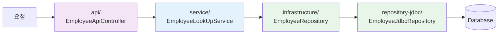

# Quick Start Guide - 신규 개발자를 위한 빠른 시작 가이드

> 이 문서는 첫 출근하는 개발자가 가장 빠르게 프로젝트를 이해하고 첫 코드를 작성할 수 있도록 돕는 가이드입니다.

## 🚀 30분 만에 시작하기

### Step 1: 환경 설정 (10분)

#### 1.1 필수 도구 설치

```bash
# 1. sdkman 설치 (Java/Kotlin 버전 관리)
curl -s "https://get.sdkman.io" | bash

# 2. Java 설치
sdk install java

# 3. Docker 설치
# Mac: https://docs.docker.com/desktop/setup/install/mac-install/
# Windows: https://docs.docker.com/desktop/setup/install/windows-install/
```

#### 1.2 IDE 설정

```bash
# IntelliJ IDEA Community 다운로드
# https://www.jetbrains.com/idea/download/

# 프로젝트 열기
# File > Open > hexagonal-module-sample 폴더 선택
```

#### 1.3 프로젝트 검증

```bash
# 프로젝트 빌드 및 테스트
./gradlew check

# 성공하면 OK!
# 실패하면 에러 메시지를 팀원에게 공유하세요.
```

### Step 2: 프로젝트 실행 (5분)

#### 2.1 애플리케이션 실행

```bash
# 통합 애플리케이션 실행
./gradlew bootRun

# 또는 CoreHR만 실행
./gradlew :corehr:application-api:bootRun

# 또는 Payroll만 실행
./gradlew :payroll:application-api:bootRun
```

#### 2.2 API 테스트

브라우저에서 Swagger UI 열기:
```
http://localhost:8080/swagger-ui.html
```

**첫 API 호출 해보기**:
1. `employee-api-controller` 섹션 펼치기
2. `GET /api/v2/corehr/companies/{companyId}/employees/{employeeId}` 선택
3. `Try it out` 클릭
4. `companyId`: 1, `employeeId`: 1 입력
5. `Execute` 클릭

성공! 직원 정보가 조회됩니다.

### Step 3: 코드 탐색 (15분)

#### 3.1 아키텍처 한눈에 보기

```
프로젝트는 두 개의 도메인으로 구성됩니다:

corehr/     → 인사 관리 (직원, 부서, 직무 등)
payroll/    → 급여 관리 (급여 정보, 지급 이력)

각 도메인은 7개 모듈로 구성:
├── model/            ← 비즈니스 객체 (Employee, Payroll 등)
├── exception/        ← 예외 (EmployeeNotFoundException 등)
├── infrastructure/   ← Repository 인터페이스
├── repository-jdbc/  ← Repository 구현 (DB 접근)
├── service/          ← 비즈니스 로직
├── api/              ← REST API
└── application-api/  ← 실행 가능한 앱
```

#### 3.2 주요 코드 위치



**실제 파일 찾기**:
```
1. API 엔드포인트
   → corehr/api/src/main/kotlin/.../employee/EmployeeApiController.kt

2. 비즈니스 로직
   → corehr/service/src/main/kotlin/.../employee/EmployeeLookUpService.kt

3. DB 접근
   → corehr/repository-jdbc/src/main/kotlin/.../employee/EmployeeJdbcRepository.kt

4. 도메인 모델
   → corehr/model/src/main/kotlin/.../employee/Employee.kt
```

#### 3.3 코드 흐름 따라가기

IntelliJ에서 실습:

1. `EmployeeApiController.kt` 열기
2. `getEmployee` 메서드에서 `service.get(...)` 위에 커서 놓기
3. `Cmd+B` (또는 `Ctrl+B`) 누르기
4. → `EmployeeLookUpService` 인터페이스로 이동
5. 다시 `Cmd+B` → 실제 구현체 `EmployeeLookUpServiceImpl`로 이동
6. `employeeRepository.findByEmployeeIdentity(...)` 에서 `Cmd+B`
7. → `EmployeeRepository` 인터페이스로 이동
8. 다시 `Cmd+B` → `EmployeeRepositoryImpl`로 이동

**축하합니다!** 전체 코드 흐름을 따라갔습니다! 🎉

---

## 💻 첫 코드 작성 - "Hello World" 수준

### 미션: 직원 목록 조회 API 추가하기

**요구사항**: 회사의 모든 직원 목록을 조회하는 API를 추가하세요.

#### Step 1: Repository에 메서드 추가 (이미 존재함!)

```kotlin
// corehr/infrastructure/src/.../EmployeeRepository.kt
interface EmployeeRepository {
    fun findAllByCompanyIdentity(companyIdentity: CompanyIdentity): List<EmployeeModel>
    // 👆 이미 있습니다!
}
```

#### Step 2: Service에 메서드 추가

```kotlin
// corehr/service/src/.../EmployeeLookUpService.kt
interface EmployeeLookUpService {
    fun get(
        companyIdentity: CompanyIdentity,
        employeeIdentity: EmployeeIdentity,
    ): EmployeeModel

    // 👇 이 메서드를 추가하세요
    fun getAll(companyIdentity: CompanyIdentity): List<EmployeeModel>
}

// 구현체
internal class EmployeeLookUpServiceImpl(
    private val employeeRepository: EmployeeRepository,
) : EmployeeLookUpService {

    // 기존 메서드...

    // 👇 이 메서드를 추가하세요
    override fun getAll(companyIdentity: CompanyIdentity): List<EmployeeModel> {
        return employeeRepository.findAllByCompanyIdentity(companyIdentity)
    }
}
```

#### Step 3: Controller에 API 추가

```kotlin
// corehr/api/src/.../EmployeeApiController.kt
@RestController
@RequestMapping("/api/v2/corehr")
class EmployeeApiController(
    private val service: EmployeeLookUpService,
) {
    // 기존 메서드...

    // 👇 이 메서드를 추가하세요
    @GetMapping("/companies/{companyId}/employees")
    @Operation(
        summary = "구성원 목록 조회 API",
        operationId = "getEmployees",
    )
    fun getEmployees(
        @PathVariable companyId: Long,
    ): List<EmployeeResponse> {
        return service.getAll(CompanyIdentity.of(companyId))
            .map {
                EmployeeResponse(
                    employeeId = it.employeeId,
                    employeeNumber = it.employeeNumber,
                    employeeName = it.name,
                )
            }
    }
}
```

#### Step 4: 테스트

```bash
# 애플리케이션 재시작
./gradlew bootRun
```

Swagger UI에서 테스트:
```
http://localhost:8080/swagger-ui.html

GET /api/v2/corehr/companies/1/employees
→ Execute 클릭
→ 직원 목록이 조회됩니다! 🎉
```

**축하합니다!** 첫 API를 추가했습니다! 🎊

---

## 🧭 다음 단계

### 1일차: 기본 익히기
- [ ] 프로젝트 실행 및 Swagger UI 탐색
- [ ] 코드 흐름 따라가기 (Cmd+B 활용)
- [ ] 간단한 API 메서드 추가

### 2-3일차: 구조 이해하기
- [ ] [ARCHITECTURE.md](./ARCHITECTURE.md) 읽기
- [ ] 각 모듈의 역할 이해
- [ ] 테스트 코드 작성해보기

### 1주차: 실전 작업
- [ ] 실제 티켓 할당받아 작업하기
- [ ] 코드 리뷰 받기
- [ ] 팀 컨벤션 익히기

---

## 🔍 자주 하는 실수 & 해결법

### 실수 1: 모듈을 찾을 수 없음

**증상**:
```
Cannot resolve symbol 'Employee'
```

**원인**: 모듈 의존성이 없음

**해결**:
```kotlin
// build.gradle.kts에 의존성 추가
dependencies {
    implementation(project(":corehr:model"))
}
```

### 실수 2: 빈을 찾을 수 없음

**증상**:
```
No qualifying bean of type 'EmployeeRepository'
```

**원인**: AutoConfiguration이 등록되지 않음

**해결**:
```kotlin
// AutoConfiguration 클래스 확인
@AutoConfiguration
class EmployeeRepositoryAutoConfiguration {
    @Bean
    fun employeeRepository(...): EmployeeRepository { ... }
}

// src/main/resources/META-INF/spring/ 에
// org.springframework.boot.autoconfigure.AutoConfiguration.imports 파일 확인
```

### 실수 3: 순환 참조 에러

**증상**:
```
Circular dependency detected
```

**원인**: 모듈 간 순환 의존성

**해결**:
- 의존성 방향 확인: `model` → `service` → `api` (한 방향만)
- `build.gradle.kts`에서 불필요한 의존성 제거

### 실수 4: 테스트가 실패함

**증상**:
```
integrationTest 실패
```

**원인**: Docker가 실행되지 않음 (Testcontainers 사용)

**해결**:
```bash
# Docker Desktop 실행 확인
docker ps

# Docker가 실행 중이어야 함
```

---

## 🎯 빠른 참조 - 치트시트

### IntelliJ 단축키

| 작업 | Mac | Windows/Linux |
|------|-----|---------------|
| 정의로 이동 | `Cmd+B` | `Ctrl+B` |
| 사용처 찾기 | `Cmd+Option+F7` | `Ctrl+Alt+F7` |
| 파일 찾기 | `Cmd+Shift+O` | `Ctrl+Shift+N` |
| 클래스 찾기 | `Cmd+O` | `Ctrl+N` |
| 전체 검색 | `Shift Shift` | `Shift Shift` |
| 최근 파일 | `Cmd+E` | `Ctrl+E` |

### Gradle 명령어

```bash
# 전체 빌드
./gradlew build

# 테스트 실행
./gradlew test

# 통합 테스트 실행
./gradlew integrationTest

# 특정 모듈만 빌드
./gradlew :corehr:service:build

# 애플리케이션 실행
./gradlew bootRun

# 의존성 확인
./gradlew dependencies
```

### 코드 위치 패턴

```
{domain}/{module}/src/main/kotlin/team/flex/module/sample/{domain}/{feature}/{ClassName}.kt

예시:
corehr/api/src/main/kotlin/team/flex/module/sample/corehr/employee/EmployeeApiController.kt
│      │                                               │      │        │
도메인  모듈                                             도메인   기능     클래스명
```

---

## 🆘 도움 받기

### 질문하기 전에

1. 에러 메시지 전체를 읽어보기
2. Stack Trace에서 실제 원인 찾기
3. IntelliJ의 제안 확인 (💡 아이콘)

### 질문할 때

**좋은 질문**:
```
"EmployeeRepository를 주입받으려고 하는데
'No qualifying bean of type' 에러가 발생합니다.
EmployeeRepositoryAutoConfiguration은 작성했고,
build.gradle.kts에도 의존성을 추가했습니다.
다음 중 무엇을 확인해야 할까요?"
```

**나쁜 질문**:
```
"에러나요 😢"
```

### 리소스

- **팀 위키**: [내부 위키 링크]
- **Slack 채널**: #dev-support
- **Discord Community**: https://discord.gg/3gd36XYM
- **아키텍처 문서**: [ARCHITECTURE.md](./ARCHITECTURE.md)

---

## 📚 추천 학습 순서

### Week 1: 기초
1. 프로젝트 실행 및 API 테스트
2. 간단한 API 메서드 추가
3. 단위 테스트 작성

### Week 2: 심화
1. 새로운 도메인 개념 추가
2. Repository 메서드 추가
3. 통합 테스트 작성

### Week 3: 전문
1. 도메인 간 의존성 다루기
2. 예외 처리 전략 이해
3. 성능 최적화 고려사항

### Week 4: 마스터
1. 새로운 모듈 추가
2. AutoConfiguration 작성
3. 아키텍처 개선 제안

---

**환영합니다! 🎉**

궁금한 점이 있으면 언제든 팀원에게 물어보세요.
코드로 배우는 것이 가장 빠릅니다. 화이팅! 💪

---

**문서 버전**: 1.0.0
**최종 업데이트**: 2026-02-05
