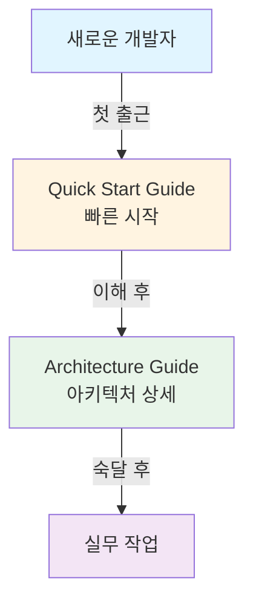

# 📚 Documentation Index

Flex Module Sample 프로젝트의 문서 모음입니다.

## 🚀 시작하기

### 신규 입사자라면?

1. **[Quick Start Guide](./QUICK_START.md)** 👈 여기서 시작!
   - 30분 만에 프로젝트 실행하기
   - 첫 코드 작성하기
   - 자주 하는 실수와 해결법

### 아키텍처를 깊이 이해하고 싶다면?

2. **[Architecture Guide](./ARCHITECTURE.md)**
   - 전체 아키텍처 구조
   - 헥사고날 아키텍처 설명
   - 장점과 단점
   - 실무 작업 가이드
   - FAQ

---

## 📖 문서 구성



---

## 🎯 역할별 추천 읽기 순서

### 백엔드 개발자 (신규)

```
Day 1:  Quick Start Guide (Step 1-2)
Day 2:  Quick Start Guide (Step 3) + 첫 코드 작성
Week 1: Architecture Guide (개요, 구조)
Week 2: Architecture Guide (실무 가이드)
Week 3: 실제 티켓 작업 시작
```

### 백엔드 개발자 (경력)

```
1시간:  Quick Start Guide 전체 훑기
2시간:  Architecture Guide 핵심 개념
3시간:  코드베이스 탐색
이후:   실무 작업 시작
```

### 프론트엔드 개발자

```
30분: Quick Start Guide (Step 1-2)
1시간: API 문서 (Swagger UI)
필요시: Architecture Guide (API 섹션)
```

### 아키텍트 / 리드

```
1시간: Architecture Guide 전체
2시간: 코드베이스 리뷰
3시간: 개선점 도출
```

---

## 📋 문서별 상세 설명

### [Quick Start Guide](./QUICK_START.md)

**목적**: 가장 빠르게 프로젝트를 이해하고 첫 코드 작성

**주요 내용**:
- 환경 설정 (10분)
- 프로젝트 실행 (5분)
- 코드 탐색 (15분)
- 첫 코드 작성 (실습)
- 자주 하는 실수 & 해결법
- 치트시트

**대상 독자**: 신규 입사자, 프로젝트 처음 접하는 개발자

**예상 소요 시간**: 30분 ~ 1시간

---

### [Architecture Guide](./ARCHITECTURE.md)

**목적**: 프로젝트 아키텍처의 깊은 이해

**주요 내용**:
- 아키텍처 구조 (Mermaid 다이어그램)
- 헥사고날 아키텍처 설명
- 모듈별 책임
- 핵심 설계 원칙
- 장점 8가지
- 단점 6가지
- 신규 입사자 가이드
- 실무 작업 가이드 (시나리오별)
- FAQ

**대상 독자**: 모든 개발자, 특히 아키텍처에 관심 있는 개발자

**예상 소요 시간**: 1 ~ 2시간

---

## 🔗 외부 리소스

### 아키텍처 참고 자료
- [Hexagonal Architecture - Alistair Cockburn](https://alistair.cockburn.us/hexagonal-architecture/)
- [Clean Architecture - Robert C. Martin](https://blog.cleancoder.com/uncle-bob/2012/08/13/the-clean-architecture.html)

### Spring Boot 참고 자료
- [Spring Boot AutoConfiguration](https://docs.spring.io/spring-boot/docs/current/reference/html/features.html#features.developing-auto-configuration)
- [Spring Data JDBC](https://spring.io/projects/spring-data-jdbc)

### Kotlin 참고 자료
- [Kotlin Official Guide](https://kotlinlang.org/docs/home.html)
- [Kotlin for Spring Boot](https://spring.io/guides/tutorials/spring-boot-kotlin)

---

## 🆘 도움받기

### 질문하기

1. **문서를 먼저 확인** - 대부분의 질문은 문서에 답이 있습니다
2. **에러 메시지를 읽어보기** - Stack Trace 확인
3. **팀원에게 질문하기** - Slack #dev-support

### Discord Community


[디스코드 채널 들어가기](https://discord.gg/3gd36XYM)

---

## 📝 문서 개선

이 문서는 살아있는 문서(Living Document)입니다.

### 개선 제안

- 이해하기 어려운 부분이 있나요?
- 더 필요한 설명이 있나요?
- 잘못된 내용을 발견했나요?

**GitHub Issue를 열어주세요** 또는 **PR을 보내주세요**!

### 문서 작성 가이드

새로운 문서를 추가하고 싶다면:

```markdown
# 문서 제목

> 한 줄 요약

## 목차
...

## 내용
...

---
**문서 버전**: 1.0.0
**최종 업데이트**: YYYY-MM-DD
**작성자**: Your Name
```

---

## 📊 문서 상태

| 문서 | 상태 | 최종 업데이트 | 작성자 |
|------|------|---------------|--------|
| Quick Start Guide | ✅ Complete | 2026-02-05 | Architecture Team |
| Architecture Guide | ✅ Complete | 2026-02-05 | Architecture Team |

---

**Happy Coding! 🎉**

